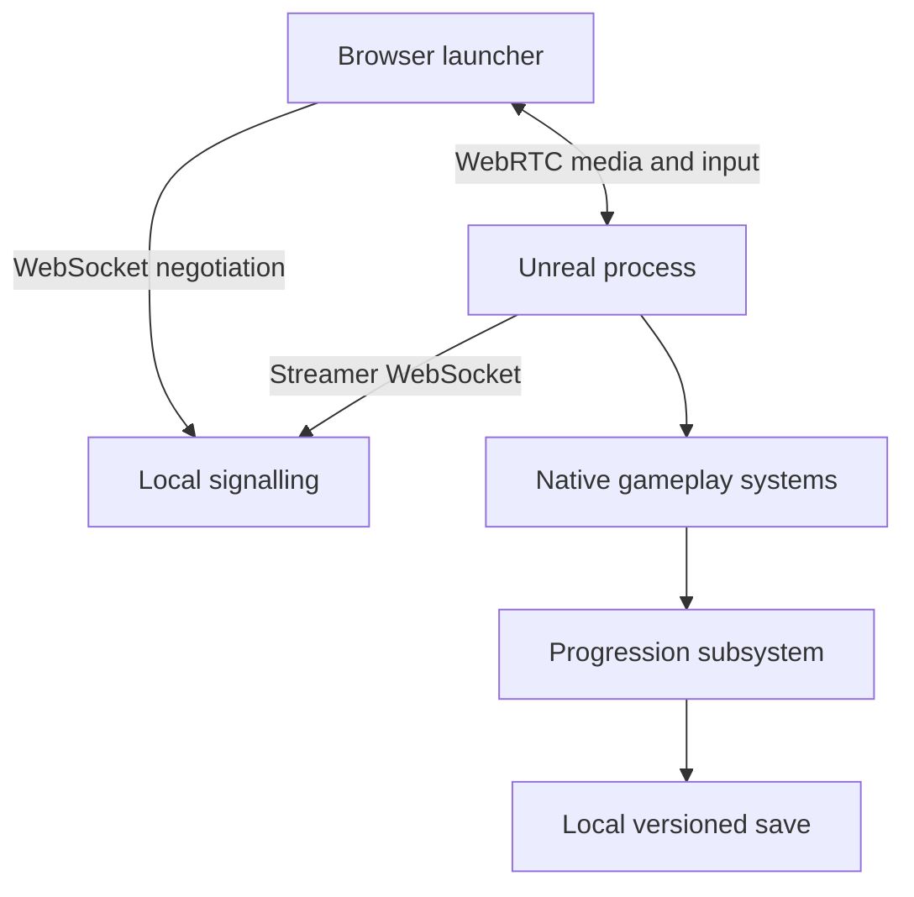
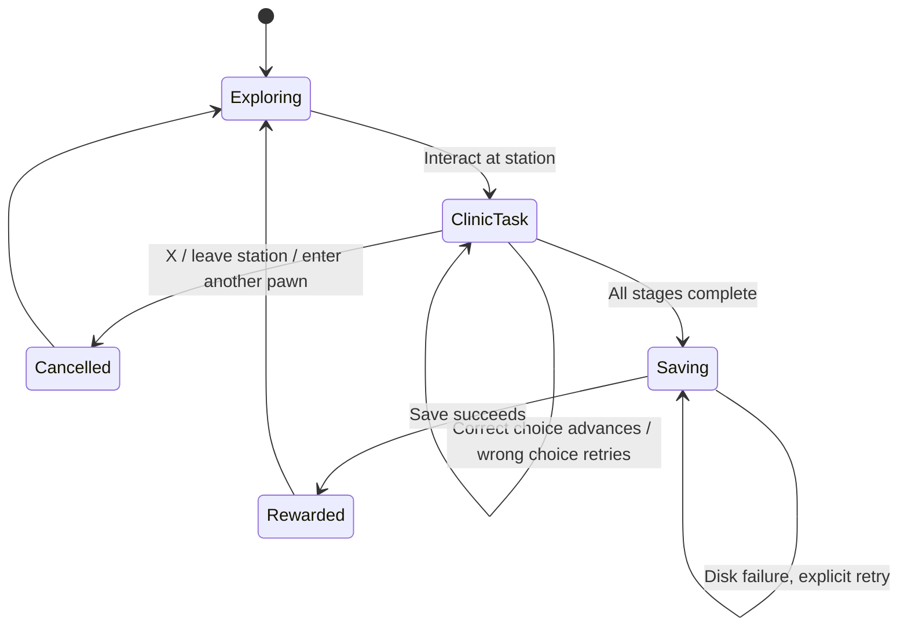

# Architecture

## Runtime boundaries

The browser receives encoded frames/audio and sends input. Unreal is the authoritative local game runtime, even though it is commonly called the “game client”. Jobs, money and progression do not run in Web. Signalling exchanges connection metadata; WebRTC carries the interactive media and input data channel.

One game process serves one local player. `max_players=1` prevents simultaneous browser controllers. This is not multiplayer or account isolation. A browser disconnect does not terminate Unreal; completed jobs remain saved. Do not expose this local configuration as a public service.

## Native systems and presentation contracts

| Native type | Owns | Blueprint responsibility |
| --- | --- | --- |
| `ACityGameMode` | Default pawn, controller and development HUD | Choose the authored player subclass and final HUD |
| `ACityPlayerController` | Enhanced Input, pawn routing, job proximity, answer input, graphics hotkeys | Final UI focus and future rebinding/accessibility presentation |
| `ACityCharacter` | Character movement, follow camera, interaction query, checkpoint restoration | Skeletal mesh, animation class and audio/VFX |
| `UCityAnimInstance` | Speed, local velocity, falling, acceleration, activity values | BlendSpace, locomotion state machine, montages, foot IK |
| `ICityInteractable` | Common prompt and interaction contract | Visual affordance and object-specific presentation |
| `UCityProgression` | Doctor state, payout, receipts, save validation | Listen to `OnChanged`; display state without calculating rewards |
| `ACityDoctorStation` | Authorised in-world entry point | `OnShiftStarted`, patient/uniform presentation |
| `ACityVehicle` | Chaos inputs, possession, stopped/clear exit checks | Mesh, physics asset, wheel/suspension tuning and sounds |
| `ACityPedestrianController` | Navigation, destination reservations, waiting/activity states | No currency or mission authority |
| `ACityPedestrian` | Current activity and avoidance | `OnActivityChanged`: play actual sitting/talking/etc. animations |
| `ACityActivityPoint` | Destination, activity duration and exclusive reservation | Place points at valid animation/use positions |
| `ACityCrossingSignal` | Vehicle/pedestrian phases, clearance time and crossing occupancy | Signal meshes and lamps |
| `ACityTrafficVehicle` | Background spline travel, swept collisions and stops | Mesh/orientation/collision setup |
| `ACityDoor`, `ACityDayNight` | Door motion, sun/moon cycle | Door mesh/pivot; daylight, skylight and environment art |

Keep the initial native code in one cohesive module. Split into plugins/modules only when a concrete reusable boundary or build cost warrants it. Public headers expose stable gameplay interfaces; implementation lives in `Private/`. `Public/Domain/JobRules.h` contains the same engine-independent clinic rules exercised by native tests.

## Doctor mission and payout

Case definitions have stable IDs. Each successful run has a generated receipt ID. All three correct steps are required. Reward starts at 50 KidzCoins, falls by 5 per mistake to a floor of 30, and adds 25 Doctor XP. On save failure, the tentative balance/XP/receipt change is rolled back in memory and the completed run can retry. Subsequent inputs after a successful payout do not issue another receipt. Active tasks are session-only and restart from the beginning after a process restart.

This is a choice-based mini-game foundation, not the completed spatial patient/tool mini-game. Replace the choice input presentation with validated examination/tool actions while keeping payout rules native. Patient or inventory state must be verified in Unreal before advancing objectives.

## NPC activity model

The small slice uses `AAIController`, native phase logic, navigation and RVO avoidance. It avoids per-frame decision searches: the brain runs once per second with staggered starts. The activity point scan is appropriate for the initial small population; replace it with a registered/spatially indexed point service before increasing density substantially.

The phases are select → reserve → navigate → perform → release. Movement failures release destinations for another plan. Crossings approach a near-side entry, wait for green, then navigate to the far-side target while holding a crossing occupancy claim. Vehicle green is blocked while that claim exists. A failed crossing move retries without releasing the claim; a stuck pedestrian therefore blocks traffic until recovered rather than allowing traffic through it.

The activity enum is not an animation implementation. Sitting, shopping, facility use and job actions need correctly positioned assets and `OnActivityChanged` presentation. Conversations currently provide state hooks, not synchronised multi-character dialogue. Indoor navigation, doors and crossing-only road traversal must be authored and verified; random reachable paths across unrestricted road navmesh are not acceptable.

## Save model and limits

`KidzCity_Local_v1` stores schema version, coins, Doctor XP, reward receipts and an optional map-qualified player transform. Checkpoints are written with F5 while grounded or after a successful vehicle exit. Restore happens once on first player possession, with Unreal's placement checks. Coin/XP saves occur when a job completes. Vehicles, NPC schedules, in-progress jobs, appearance and time of day are not persisted yet.

Version 1 accepts only the known schema and validates nonnegative money/XP, receipt IDs, duplicate receipts and ledger totals. Future/invalid saves block writes and preserve the file. Back up the save in `Unreal/Saved/SaveGames/` for Editor sessions (packaged Windows games usually use `%LOCALAPPDATA%/KidzCity/Saved/SaveGames/`) before manually moving an unreadable file aside. A production recovery UI and rotating backups are future work; synchronous SaveGame is not a crash-safe database transaction.

Local saves are editable by their owner and are not a secure online economy. The proposed future backend schema is explicitly separate from the binary SaveGame representation.

## References and version policy

- [Epic Pixel Streaming infrastructure](https://github.com/EpicGames/PixelStreamingInfrastructure) documents matching engine release branches.
- [Epic local getting-started guide](https://dev.epicgames.com/documentation/en-us/unreal-engine/getting-started-with-pixel-streaming-in-unreal-engine) documents standalone/packaged rendering and the browser connection path.
- Exact inspected source revision: `aa4972e5c9d53b0032d4f209e3f7728218b6213f` on `UE5.7`. `Infrastructure/versions.json` is the version inventory. Upgrade engine, plugin configuration, infrastructure and frontend together, then rerun end-to-end acceptance.
